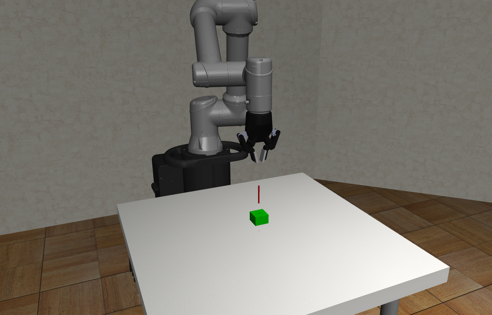
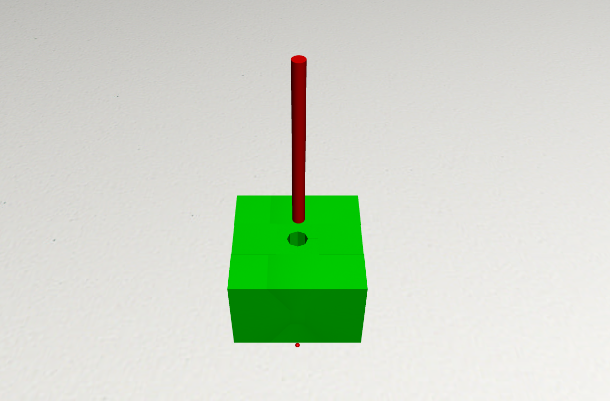

# Reinforcement Learning Simulation Framework for PiH assembly task.

Simulation framework created based on Robosuite framework (https://github.com/ARISE-Initiative/robosuite). 
It utilizes mujoco engine to model phyiscs of the enviornment. This repository contains simulation framework used to learn impedance parameters using reinforcement learning, more specifcally PPO. 

## System Overview
* Robot: UR5e (6DOF)
* Controller: PD (in free space) and Impedance + PD (in contact)
* Trajectory planner: Minimum jerk trajectory
* RL: Utilizes PPO for learning impedance parameters based on stable baseline 3 implementation.
* Facilitates parallel learning: more specifically creation of parallel enviornments for experience collection

<div align="center">
  
</div>

 <div align="center">
  
</div>

## Usage
Run ```main_model_learn.py``` for learning, evaluation, visualization. </br>
To use parallel learning functionality use `main_multi_learn.py`.

## Instalation 
For details see https://github.com/ARISE-Initiative/robosuite.

## Configuration Options
The configuration option will be explained base on `main_model_learn.py`
<div align="center">
  
</div>


* `use_spiral`:  [boolean] whether to use spiral search
* `use_ml`: whether to use ML model
* `use_impedance`: if True, impedance controller is used for the contact stage of simulation, else a PD controller is utilized
* `plot_graphs`: whether to display graphs at the end of episode (for training set to `False`)
* `error_type`: `[ring, None, fixed]`: defines position error type
* `error_vec`: defines magnitude of position error for `error_type=fixed`
* `overlap_wait_time`: defines wait time when switching between spiral search and impedance control
* `mode`: `eval/new_train/continue_train`: self explanatory

## More details
Includes: 
* Custom environment for PiH includes peg, board with a hole.
Can be found in `robosuite/enviornments/manipulation/peg_in_hole_4_mm.py`
* Custom controllers including PD and Impedance Controllers for PiH, PiH with spiral search.
Can be found `robosuite/controllers/...`
* Main run files:
1. To run evaluation/ visualization or learning using one environment at a time use:
`main_model_learn.py`
2. For learning using multiple environments using stable-baselines-3 use:
`main_multi_learn.py`

### Important to note
1. When learning is completed two new folders will be created:
`/robosuite/robosuite`: contains various callbacks, best models, and network parameters
`/robosuite/learning_logs` contains tensorboard logs that can be used via` tensorboard --logdir=./learning_1` to display interactive plots.
2. To figure out multiprocessing go to sb3 github and look for issues with my username, I asked a lot of question so you will be able to figure it out based on responses I got :)

Good Luck !
